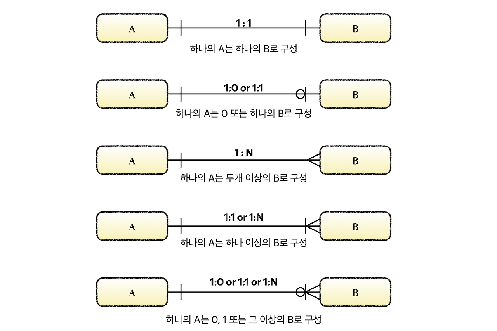

## 데이터 모델링

 

데이터 모델링은 데이터 구조와 관계를 체계적으로 설계하여 현실 세계의 데이터를 효율적으로 관리하는 과정이다.

 

### 데이터 모델링의 특징

- **추상화(Abstraction)**  
  - 복잡한 현실에서 핵심적인 개념이나 원리를 **추출**하고 **일반화**하여, 더 단순한 형태로 표현한다.  
- **단순화(Simplification)**  
  - 복잡한 정보나 과정을 더 쉽게 이해하고 관리할 수 있도록 한다.  
- **명확화(Clarification)**  
  - 복잡하거나 애매한 개념을 쉽게 설명하여 이해를 돕는다.  
- **정확화(Precision)**  
  - 데이터를 명확하고 구체적으로 정의하여, 오해의 여지를 줄이고 일관성을 유지한다.  

 

## 데이터 모델링 3요소

- **개체(Entity)**  
  - 정의: **독립적으로 존재하며 데이터로 저장할 가치가 있는 객체**  
  - 예시: `학생(Student)`, `교수(Professor)`, `과목(Course)`  
  - 특징: 개체는 하나 이상의 **고유한 속성(Primary Key)**을 가지며, 다른 개체와 관계를 형성할 수 있다.  

- **속성(Attribute)**  
  - 정의: 개체의 성질, 특성 또는 상태를 설명하는 데이터  
  - 예시: `학생(Student)` 개체의 속성으로 `학번(StudentID)`, `이름(Name)`, `전공(Major)` 등  
  - 특징: 속성은 개체를 더 구체적으로 설명하며, 데이터베이스에서는 테이블의 컬럼으로 표현된다.  

- **관계(Relationship)**  
  - 정의: 두 개 이상의 개체 간의 연관성을 나타낸다.  
  - 예시:  
    - **1:1 관계 (One-to-One)** → `사원(Employee)` - `사원증(ID Card)` (한 명의 사원은 하나의 사원증을 가짐)  
    - **1:N 관계 (One-to-Many)** → `학생(Student)` - `수강(Course Enrollment)` (한 명의 학생은 여러 과목을 수강할 수 있음)  
    - **N:M 관계 (Many-to-Many)** → `학생(Student)` - `동아리(Club)` (한 학생이 여러 동아리에 가입할 수 있고, 한 동아리에 여러 학생이 가입할 수 있음)  

 

## 데이터 모델링 과정

- **개념적 모델링**  
  - 정의: 가장 **높은 수준의 추상화**를 제공하는 모델링 단계로, 전체 시스템에 대한 개괄적인 뷰를 제공한다.  
  - 목적: 주요한 비즈니스 규칙을 정의하고, 시스템의 주요 엔티티와 그 관계를 이해하는 데 초점을 맞춘다.  
  - 도구: `ERD(Entity-Relationship Diagram)`, `개념적 데이터 모델 다이어그램`  

- **논리적 모델링**  
  - 정의: 개념적 모델을 기반으로 하여, 데이터 모델을 더욱 구체화하는 단계이다. **DBMS에 독립적이며**, 엔터티의 속성(데이터 필드), 데이터 타입, 제약 조건(Primary Key, Foreign Key, Not Null, Unique) 등을 정의한다.  
  - 목적: 데이터의 논리적 구조를 정의하여 **정규화된 데이터 모델을 구축**한다.  
  - 도구: `정규화`, `관계형 스키마`, `UML 다이어그램`  

- **물리적 모델링**  
  - 정의: 데이터 모델이 **실제 데이터베이스 시스템**에서 어떻게 구현될지를 정의하는 단계이다.  
  - 목적: 테이블, 인덱스, 접근 경로 등의 물리적 구조를 설계하여, 데이터의 저장 방식과 데이터베이스의 성능을 최적화한다.  
  - 도구: `테이블 설계`, `인덱스(Index)`, `파티셔닝(Partitioning)`, `데이터베이스 트랜잭션 설계`  

 

## 데이터베이스 3단계 구조

- **외부 스키마**: 사용자나 응용 프로그램이 데이터를 보는 방식을 정의하는 수준  
- **개념 스키마**: 데이터베이스의 전체적인 논리적 구조와 정책을 정의하는 수준으로 모든 외부스키마를 통합한 형태
- **내부 스키마**: 데이터가 실제로 물리적인 저장소에 어떻게 저장되는지를 정의하는 수준  

 

## ERD(Entity Relationship Diagram)

- 데이터 모델을 시각적으로 표현하는 다이어그램.  
- 표기법:  
  - **엔터티(Entity)** → `사각형(Rectangle)`  
  - **속성(Attribute)** → `타원형(Oval)`  
  - **관계(Relationship)** → `마름모(Diamond)`  
  - **PK(Primary Key) 속성** → 속성명 **밑줄**  
  - **FK(Foreign Key) 속성** → 속성명 *점선 밑줄*  

 

## 관계의 표기법

- **관계차수(Cardinality)**  
  - 두 엔티티 간의 관계에서 수행되는 경우의 수  
  - 예시:  
    - `1:1 관계 (One-to-One)`  
    - `1:N 관계 (One-to-Many)`  
    - `N:M 관계 (Many-to-Many)`  

 

## 식별자(Identifier)

- 엔티티 내의 인스턴스를 고유하게 식별하는 속성(또는 속성의 집합)  

### **식별자의 유형**  
1. **주식별자 (Primary Key, PK)**  
   - 정의: 엔티티 내의 각 인스턴스를 유일하게 식별하는 속성 또는 속성의 조합  
   - 특징:  
     - **고유성(Unique)**: 같은 값을 가지는 두 개의 레코드는 존재할 수 없음.  
     - **최소성(Minimality)**: PK는 최소한의 속성으로 구성되어야 함.  
     - **불변성(Immutability)**: PK 값은 변경되지 않아야 함.  
   - **단일 PK(Single Attribute PK)** vs. **복합 PK(Composite PK)**  
     - 단일 PK: `학번(StudentID)`  
     - 복합 PK: `(주문번호(OrderID), 상품번호(ProductID))`  

2. **보조식별자 (Alternate Key)**  
   - 주식별자 외에 엔티티를 식별할 수 있는 다른 속성  
   - 예시: `주민등록번호(SSN)`, `운전면허번호(Driver’s License Number)`  

3. **외부식별자 (Foreign Key, FK)**  
   - 다른 엔티티의 PK를 참조하여 관계를 형성하는 속성
   - 단순히 식별 목적을 위해 생성되는 키이며, 비즈니스 로직과 직접적인 연관이 없는 값이다.
   - 예시: `학생 테이블(Student)`의 `학과ID(DepartmentID)`는 `학과 테이블(Department)`의 `학과ID(DepartmentID)`를 참조  

4. **인조식별자 (Surrogate Key)**  
   - 엔티티의 식별을 위해 인위적으로 생성된 속성  
   - 예시: `Auto Increment ID`, `UUID`  

 

## 정리

- 데이터 모델링은 **개념적, 논리적, 물리적 모델링**으로 나뉘며, 각 단계는 데이터의 구조를 점점 구체화한다.  
- **정규화(Normalization)** 과정을 통해 중복을 최소화하고 데이터 무결성을 유지한다.  
- 데이터 모델링을 효과적으로 수행하기 위해서는 ERD, 관계형 데이터 모델, 정규화 원칙을 잘 이해해야 한다.  
- 실무에서는 논리적 모델링(3NF까지 정규화)을 기본적으로 적용하고, 성능 최적화를 위해 필요할 경우 물리적 모델링에서 일부 비정규화(Denormalization)를 수행하기도 한다.
